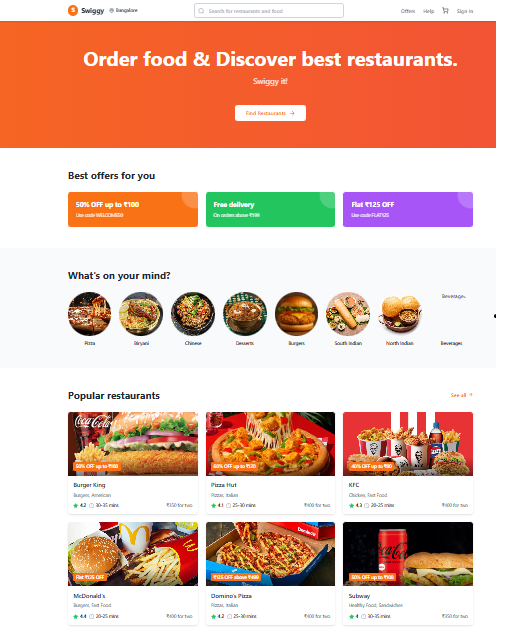

# 🍔 Swiggy Clone – Food Delivery Web App

  

  
  
  
  

---

## 🌟 About the Project

This **Swiggy Clone** is a frontend web application inspired by the popular food delivery platform **Swiggy**.  
It focuses on **UI replication, smooth navigation, and modern frontend practices**, making it ideal for **learning, practice, and portfolio showcasing**.

> ⚠️ This project is for **educational purposes only** and is not affiliated with Swiggy.

---

## 🔗 Live Demo

🚀 **Visit Here:**  
👉 https://swiggy-cloning.netlify.app/

---

## ✨ Key Features

✅ Modern Swiggy-style UI  
✅ Restaurant & food listing  
✅ Menu browsing interface  
✅ Responsive design (mobile + desktop)  
✅ Clean component-based architecture  
✅ Fast performance with Vite  

---

## 🛠️ Tech Stack

| Technology | Usage |
|-----------|-------|
| **React** | UI Development |
| **TypeScript** | Type-safe JavaScript |
| **Vite** | Fast build & dev server |
| **CSS / Tailwind** | Styling |
| **Netlify** | Deployment |

---

## 📂 Project Structure

swiggy-clone/ 
│ 
├── public/ # Static assets 
├── src/ 
│ ├── components/ # Reusable UI components 
│ ├── pages/ # Application pages 
│ ├── assets/ # Images & icons 
│ ├── App.tsx # Root component 
│ └── main.tsx # Entry point 
│ 
├── package.json 
├── vite.config.ts 
└── README.md 

---

## 🚀 Getting Started

Follow these steps to run the project locally:

### 1️⃣ Clone the Repository

git clone https://github.com/Sguha77/swiggy-clone.git

2️⃣ Navigate to Project Folder

cd swiggy-clone

3️⃣ Install Dependencies

npm install

4️⃣ Start Development Server

npm run dev

📍 Open in browser :

http://localhost:( your localhost )

📦 Deployment :

This project is deployed using Netlify.
You can deploy your own version using:

Netlify

Vercel

GitHub Pages (static build)

🤝 Contributing :

Contributions are always welcome!
Fork the repository
Create a new branch
Make your changes
Submit a Pull Request

📜 License :

This project is open-source and available for learning and portfolio use.

🙌 Acknowledgements :

Inspired by Swiggy

Built with ❤️ using React & Vite

Thanks to the open-source community

⭐ If you like this project, give it a star on GitHub!
Happy Coding 🚀

---
